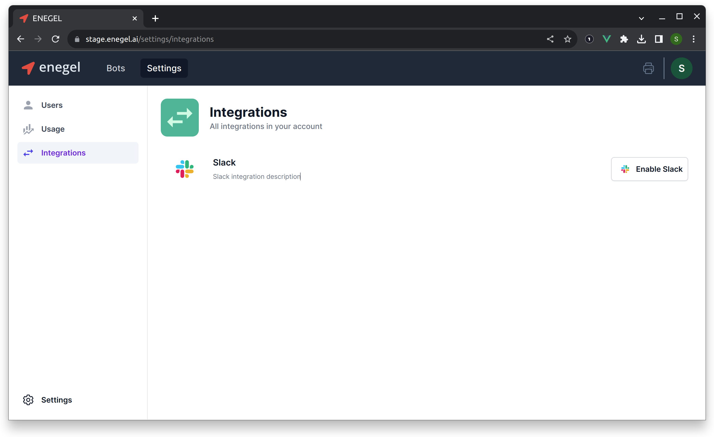
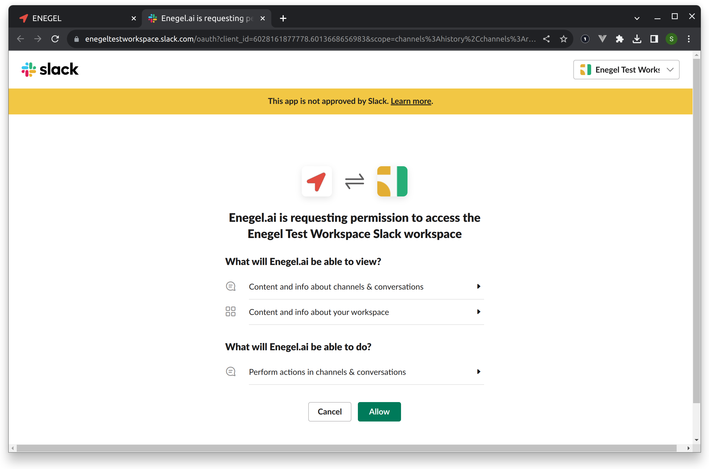
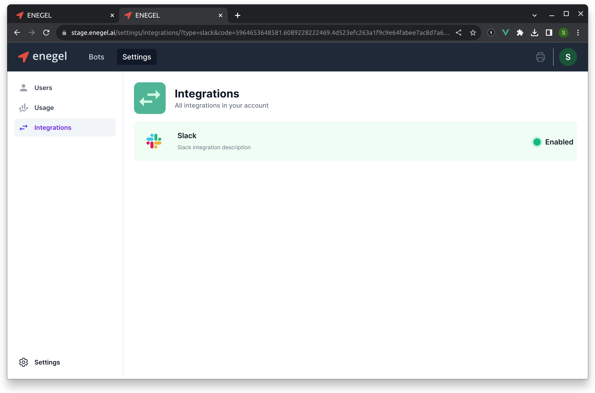
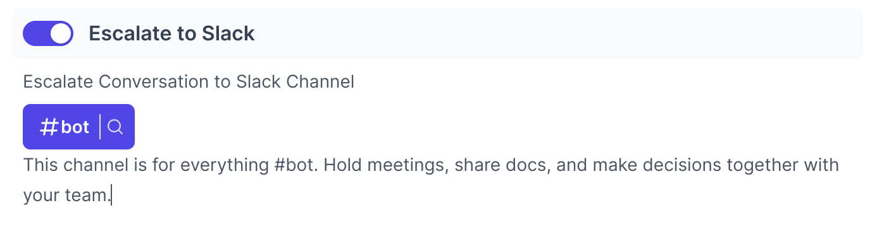

# Slack Integration

Enegel.ai provides Slack integration fully supporting [OAuth 2.0](https://oauth.net/2/) flow.

Enegel.ai Slack Application can be installed in your Slack workspace to enable exchanging messages with your Bots users.

Follow this guide to enable Slack integration.

## Log in to your account at enegel.ai  

Log in to [app.enegel.ai](https://app.enegel.ai)

:::info

You must have `admin` role to enable Slack integration.

:::

## Enable Slack integration

Navigate to `Settings`, `Integrations` and click `Enable Slack` 

You will be directed to the Slack page to allow Enegel.ai app installation:

Enegel.ai Slack application requests the following OAuth scopes:

| OAuth Scope | Description                                                                         |
|-------------|-------------------------------------------------------------------------------------|
| channels:history  | View messages and other content in public channels that Enegel.ai has been added to |
| channels:read   | View basic information about public channels in a workspace                         |
| chat:write   | Send messages as @Enegel.ai                         |
| chat:write.customize   | Send messages as @Enegel.ai with a customized username and avatar              |
| groups:read   | View basic information about private channels that Enegel.ai has been added to     |
| usergroups:read   | View user groups in a workspace   |
| users.profile:read   | View profile details about people in a workspace |

Click `Allow` to approve, and you will be redirected back to Enegel.ai where you will see Slack integration as enabled. 

## Invite Enegel.ai to desired Channels in your Slack Workspace

To exchange messages with your Bots, Enegel.ai needs to be added to Channels in your Slack workspace where you want to process Bot messages.
Invite Enegel.ai app to the Channels of your choice as usual. 

## Tell your Bot which Slack Channel to send messages to  

Now you can configure your Bot to exchange messages with Slack. 
In Bot Settings, select Slack Channel you would like Bot to send messages to. 

## Slack App approval

It is safe to use Enegel Slack App. We follow all the recommendations and guidelines provided by Slack. At the moment,the Slack Worspace notes that Enegel application is not yet approved by Slack. The approval process takes time and we have been working on it. 

