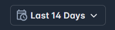
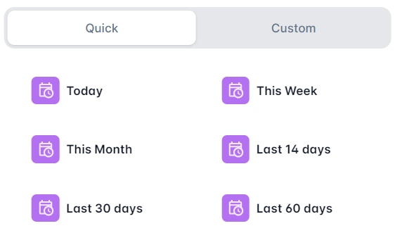

# Voice Of Customer
Voice Of Customer functionality is available after clicking **VoC** in the main top menu bar.

**Note:** If the **VoC** button is not available, please see the **How to Enable Ticket Ingestion for VoC** section at the bottom of this document.

There are these main screens for **Voice Of Customer** product:
* **Voice Of Customer** this is the main screen providing a high level summary for a particular time period. 
* **Conversations** this screen provides access to the details of the conversations for a particular time period. 
* **Agents** this screen gives detailed information about agents contributing to CSAT for a particular time period.

## Selecting the time period

It is important to select the time period for the analysis. The selected time period is shown on the right side of the top menu bar. 

Click on it to select a new time perid. Then select between predefined periods such as **Last 30 days** 

or create a custom time interval.

## Voice Of Customer 

The top part of the screen contains key parameters:
* **Time Period**
* **Number of Conversations** analyzed for this period
* **Average CSat**
* **Smallest CSat**

At the bottom of the screen there is a chart depicting CSat change within the given time interval

## Conversations

The Conversations screen has a table with all the conversations analyzed for the given period of time. The table can be sorted by any column by clicking on that column, or a transcript of the conversation can be presented by clicking on that conversation

## Agents

The Agents screen summarized statistics for the top and bottm performers

Absolutely—here’s the **clean, link-free version**, formatted plainly so you can easily copy it into the GitHub editor:

---

# How to Enable Ticket Ingestion for VoC

## Step 1: Create Two Jobs

First, you need to create two jobs in the system.

Navigate to the Jobs Settings page under https://app.enegel.ai/settings/jobs/list

### Ticket QA Ingest Job
This job will be responsible for evaluating the quality of tickets.

### Ticket Ingest Job
This job will handle ticket ingestion into the system.

---

## Step 2: Assign the Jobs in Advanced Settings

Once the jobs are created, assign them in the Advanced Settings.

Go to the Advanced Settings page and select the jobs you created in the relevant configuration fields under https://app.enegel.ai/settings/advanced

---

## Step 3: Enable CSAT in Firestore Tenant Settings

Finally, enable CSAT (Customer Satisfaction) in your Firestore configuration:

1. Locate the setting named `productEnabledCSat`.
2. Set its value to `True`.
**Note:** At the time fo this writing, this setting must be changed by the engineering team.

---

