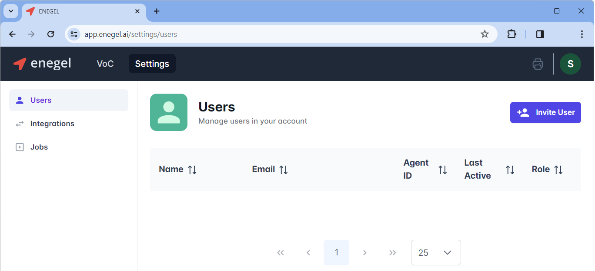

# Managing Users
To start using enegel.ai application, it is required to add users.

## Adding the first admin user
Select one user with the administrative privileges and provide Enegel.ai with full name and email address for that user. The user will receive email invitation to setup the password. After that this user will be able to log in https://app.enegel.ai/ and continue adding other users

## Types of users

There are three types of users:
* **Admin** user that has full permission to all functionality including adding, removing, editing other user access right
* **User** user that has access to to all functionality, except for managing other users
* **Agent** has access to personal reports and coaching recommendations only

## Adding a user

The admin user can add a user by clicking **Settings** in the top bar, and then pressing **Invite User** button

After pressing **Invite User** button, a new dialog appears that enables entering user information: full name, email and the role (Admin, User, Agent)

After all the information is entered, press **Invite** button at the bottom right. An email invitation will be sent to the user inviting the user to enter the password

